# cloudformation_aws_examples

Example of aws configuration using cloudformation

## Kinesis Data Firehose and API Gateway

[Definition file: kinesis_firehose_api_gateway](./kinesis_firehose_api_gateway)


### Quick Start

`cd ./kinesis_firehose_api_gateway`

confirmation of make command.

`make help`

1. s3 deploy. for storing glue data.

```
make 1-cfn-s3-deploy \ 
    CFN_DEPLOY_ROLE_ARN=arn:aws:iam::${AccountId}:role/${RoleName} \ 
    ENV=stg

```

2. glue deploy.　define database, table.

```
make 2-cfn-glue-deploy \ 
    CFN_DEPLOY_ROLE_ARN=arn:aws:iam::${AccountId}:role/${RoleName} \ 
    ENV=stg  \
    GLUE_DATABASE_NAME=stg_realtime_events
```

3. deploy kinesis data firehose, api gateway, etc. 
   * ApiKey: should be at least 20 characters

```
make 3-cfn-api-kinesis-deploy  \
 	CFN_DEPLOY_ROLE_ARN=arn:aws:iam::${AccountId}:role/${RoleName} \ 
    ENV=stg  \
 	S3_KEY_ARN=arn:aws:kms:${Region}:${AccountId}:key/${KeyHash} \
 	ALLOW_IP_ADDRESS_LIST=${IpList} \
 	BASE_API_KEY='${ApiKey}' 
```

4. deploy api gateway. redeploy the api when you change the definition regarding the api gateway

```
make api-gateway-deploy \
 	ENV=stg \
 	REGION=${Regions}
```

The above command will create the following resources

* S3
* Glue database
* Glue table
* IAM Role
  * api gateway role
  * firehose role
* Log group
* KinesisFirehose
  * DeliveryStream
* ApiGateway
  * RestApi
  * Resource
  * Method
  * Deployment
  * Api Key
  * Usage plan
* CloudWatch dashboard

## AWS Batch

[Definition file: aws_batch](./aws_batch)


### QuickStart


`cd ./aws_batch`

confirmation of make command.

`make help`

1. cloudformation deploy to create Elastic Container Registry. ENV can be selected from dev, stg, prd

```
make ecr-cfn-deploy \ 
    ENV=stg \  
    CFN_DEPLOY_ROLE_ARN=arn:aws:iam::${AccountId}:role/${RoleName}
```

2. docker deploy

```
 make docker-deploy \ 
    DOCKER_IMG=${AccountId}.dkr.ecr.${Region}.amazonaws.com \  
    ENV=stg  \
    IMG_VER=latest
```

3. aws batch deploy. before executing the following command, please create an S3 Bucket for cloudformation package.
   Pass the created S3Bucket as an argument to TEMPLATE_S3_BUCKET

```
 make batch-cfn-deploy \ 
      TEMPLATE_S3_BUCKET=${TemplateS3Bucket}
      CFN_DEPLOY_ROLE_ARN=arn:aws:iam::${AccountId}:role/${RoleName} \
      ENV=stg \ 
      VPC_ID=${VpcId}  \
      SUBNET_IDS="${SubnetId-A},${SubnetId-B}" \
      IMG_VER=${ImgVer}
```

The above command will create the following resources

* ECR Repository
* IAM Role
  * Batch service role
  * Execution role
  * Events role
* Security group
* Compute environment
* Job queue
* Job definitions
* Events rule (Event Bridge)

## ECS task

[Definition file: ecs_task](./ecs_task)



### QuickStart


`cd ./ecs_task`

confirmation of make command.

`make help`

1. cloudformation deploy to create Elastic Container Registry.

```
make ecr-cfn-deploy \ 
    ENV=stg \       
    CFN_DEPLOY_ROLE_ARN=arn:aws:iam::${AccountId}:role/${RoleName}
```

2. docker deploy

```
 make docker-deploy \  
    DOCKER_IMG=${AccountId}.dkr.ecr.${Region}.amazonaws.com \
    ENV=stg  \
    IMG_VER=latest
```

3. ecs deploy. 
   * before executing the following command, please create an S3 Bucket for cloudformation package. 
   * pass the created S3Bucket as an argument to TEMPLATE_S3_BUCKET (bucket_name)
   * also, create an ECS cluster for ECS tasks
   * ECS cluster should be passed ARN as argument of CLUSTER_ARN

```
 make ecs-cfn-deploy \ 
      TEMPLATE_S3_BUCKET=${TemplateS3Bucket}
      CFN_DEPLOY_ROLE_ARN=arn:aws:iam::${AccountId}:role/${RoleName} \
      VPC_ID=${VpcId}  \
      SUBNET_IDS="${SubnetId-A},${SubnetId-B}" \
      IMG_VER=${ImgVer} \ 
      CLUSTER_ARN=${ClusterArn} \ 
      ENV=stg \

```

The above command will create the following resources

* ECR Repository
* LogGroup
* IAM Role
    * Execution role
    * Events role
* Task definitions
* Events rule (Event Bridge)

## ECS API Server

[Definition file: ecs_api](./ecs_api)


### QuickStart


`cd ./ecs_api`

confirmation of make command.

`make help`

1. cloudformation deploy to create Elastic Container Registry.

```
make ecr-cfn-deploy\ 
    ENV=stg 
    CFN_DEPLOY_ROLE_ARN=arn:aws:iam::${AccountId}:role/${RoleName}
```

2. go build

```
make build
```

3docker deploy

```
 make docker-deploy \  
    DOCKER_IMG=${AccountId}.dkr.ecr.${Region}.amazonaws.com \
    ENV=stg  \
    IMG_VER=latest
```

4. ecs api deploy.
    * create Cluster for VPC, Subnet, ECS before execution

```
 make ecs-cfn-deploy \ 
      CFN_DEPLOY_ROLE_ARN=arn:aws:iam::${AccountId}:role/${RoleName} \
      ENV=stg \
      IMG_VER=${ImgVer} \
      ALLOW_IP_ADDRESS=${ALLOW_IP_ADDRESS}\
      VPC_ID=${VpcId} \
      SUBNET_IDS="${SubnetId-A},${SubnetId-B}" \
      CLUSTER_NAME=${ClusterName} \
      ALB_CERTIFICATION_ARN=${ALBCertificateArn}\ 
      REGION=${Region}
```

The above command will create the following resources

* ECR Repository
* LogGroup
* IAM Role
    * Execution role
* Security group
* ALB
  * Load balancer
  * Target group
  * Listener
* Task definitions
* Service
